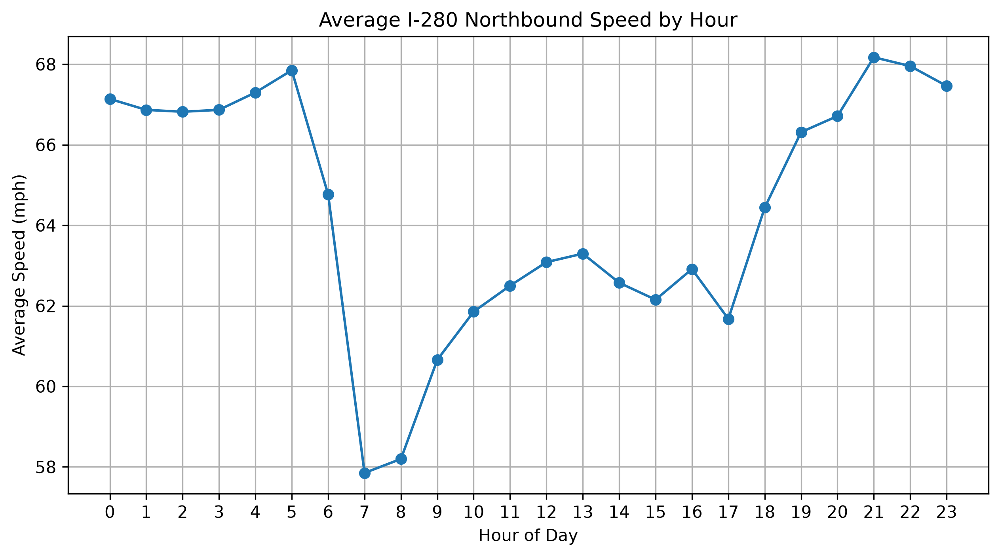
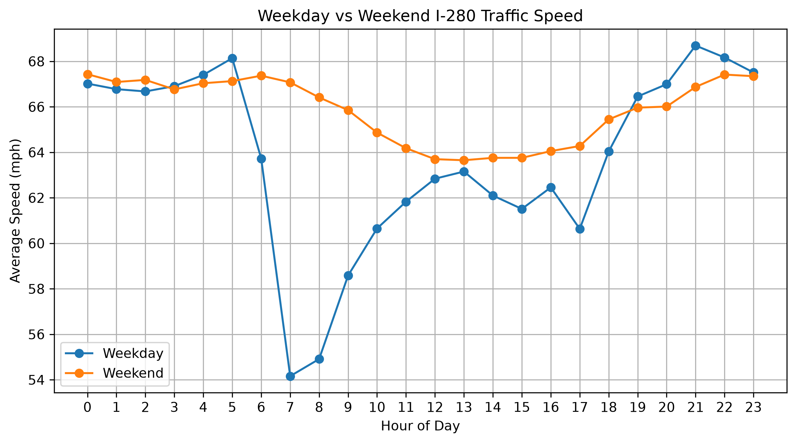
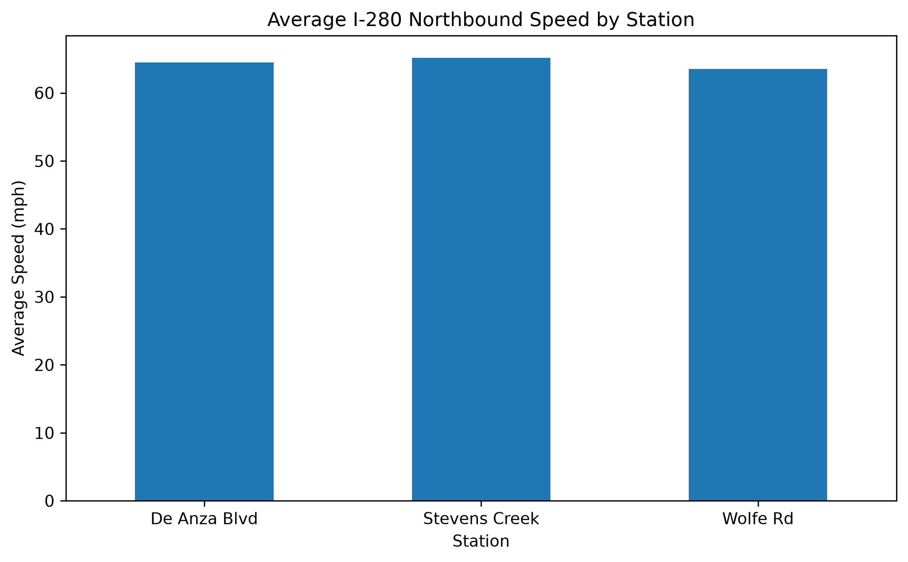

# Bay Area Traffic Analysis & Speed Predictor

A data science and machine learning project analyzing I-280 North traffic patterns using Caltrans PeMS data.

## Live Application

Try the interactive traffic speed predictor:

**[Launch Traffic Speed Predictor](https://freooss-bay-area-traffic.streamlit.app/)**

The application uses a trained Random Forest regression model to estimate traffic speed based on traffic flow and time of day.

---

## Project Overview

Traffic conditions can vary significantly depending on time of day, location, and traffic volume.

This project uses real-world 5-minute traffic observations from Caltrans PeMS to analyze traffic conditions along I-280 North in Santa Clara County.

The analysis focuses on three freeway monitoring locations:

- Stevens Creek Blvd
- Wolfe Rd
- De Anza Blvd

The project follows an introductory end-to-end data science workflow:

**Data Collection → Data Cleaning → Feature Engineering → Exploratory Data Analysis → Visualization → Machine Learning → Model Deployment**

---

## Project Goals

This project explores the following questions:

- How does average freeway speed change throughout the day?
- When do the largest traffic slowdowns occur?
- How do weekday and weekend traffic patterns differ?
- How do traffic speeds differ between monitoring locations?
- What relationship exists between traffic flow and speed?
- Can machine learning estimate freeway speed from traffic conditions?

---

## Data

Traffic data comes from the California Department of Transportation Performance Measurement System (Caltrans PeMS).

The dataset contains 5-minute traffic observations from I-280 North monitoring stations in Santa Clara County.

Main variables include:

- Date
- Time
- Traffic flow
- Average traffic speed
- Station location
- Sensor observation quality

The analysis combines observations from three monitoring stations into a single dataset for comparison and modeling.

Raw PeMS data is excluded from this repository.

---

## Data Processing

Python and Pandas are used to prepare the raw PeMS traffic data for analysis.

The processing workflow includes:

1. Importing raw PeMS text files
2. Converting the data into Pandas DataFrames
3. Combining data from multiple traffic stations
4. Converting date and time information into datetime values
5. Checking missing values and observation quality
6. Creating additional features from the original data
7. Exporting a cleaned dataset for analysis and modeling

### Feature Engineering

Additional features are created from the original traffic observations, including:

- Hour of day
- Day of week
- Weekday/weekend indicator
- Station identifier

These features make it possible to analyze temporal traffic patterns and provide useful inputs for machine learning.

---

## Exploratory Data Analysis

Exploratory Data Analysis (EDA) is used to identify patterns in traffic speed and flow across different times and monitoring locations.

### Average Speed by Hour

This visualization shows how average I-280 North traffic speed changes throughout the day.



### Weekday vs Weekend Traffic

This visualization compares hourly traffic speeds between weekdays and weekends.



### Station Comparison

Average traffic speeds are compared between the Stevens Creek Blvd, Wolfe Rd, and De Anza Blvd monitoring locations.



---

## Machine Learning

The project explores whether traffic speed can be estimated using machine learning.

The problem is treated as a **regression problem** because the prediction target, traffic speed, is a continuous numerical value.

### Input Features

The current model uses:

- Hour of day
- Weekday/weekend status

These features allow the model to learn differences between
typical weekday commuting patterns and weekend traffic patterns.

### Prediction Target

The model predicts:

- Average traffic speed (mph)

### Linear Regression

Linear Regression is used as a baseline model to determine how well a simple linear relationship can describe traffic speed.

### Random Forest Regression

A Random Forest Regressor is used to capture more complex and nonlinear relationships between traffic flow, time of day, and traffic speed.

### Model Evaluation

Model performance is evaluated using:

- **Mean Absolute Error (MAE)** — measures the average prediction error in mph
- **R² Score** — measures how much variation in traffic speed is explained by the model

---

## Interactive Traffic Speed Predictor

The trained Random Forest model is integrated into an
interactive web application built with Streamlit.

Users select:

- Time of day
- Weekday or weekend

The application uses these inputs to estimate typical
I-280 North traffic speed based on patterns learned from
historical Caltrans PeMS traffic data.

The application demonstrates the following workflow:

**User Input → Feature Processing → Random Forest Model → Speed Prediction**

> **Note:** Predictions represent patterns learned from a limited
> historical dataset and should not be interpreted as real-time
> traffic information.

---

## Technologies Used

- Python
- Pandas
- Matplotlib
- scikit-learn
- Streamlit
- Joblib
- Jupyter Notebook
- Git
- GitHub

---

## Project Structure

```text
bay_area_traffic_analysis/
│
├── data/
│   ├── raw/
│   └── processed/
│       └── i280_nb_cleaned.csv
│
├── images/
│   ├── average_speed_by_hour.png
│   ├── station_comparison.png
│   └── weekday_weekend.png
│
├── models/
│   └── traffic_speed_model.pkl
│
├── notebooks/
│   ├── 01_exploration.ipynb
│   └── 03_modeling.ipynb
│
├── app.py
├── README.md
├── requirements.txt
└── .gitignore
```

---

## Running the Application Locally

To run the project locally, first clone the repository and open the project directory.

### 1. Create a Virtual Environment

```bash
python3 -m venv .venv
```

Activate the virtual environment on macOS or Linux:

```bash
source .venv/bin/activate
```

### 2. Install Dependencies

Install the required Python packages:

```bash
python -m pip install -r requirements.txt
```

### 3. Run the Streamlit Application

Start the application with:

```bash
streamlit run app.py
```

The application should automatically open in your web browser.

By default, Streamlit typically runs locally at:

```text
http://localhost:8501
```

---

## Skills Demonstrated

This project demonstrates experience with:

- Working with real-world transportation data
- Data collection and preprocessing
- Pandas DataFrame manipulation
- Data cleaning and quality checks
- Feature engineering
- Exploratory Data Analysis (EDA)
- Data aggregation using Pandas
- Data visualization with Matplotlib
- Regression modeling
- Train/test splitting
- Linear Regression
- Random Forest Regression
- Model evaluation using MAE and R²
- Saving and loading trained machine learning models
- Building an interactive Streamlit application
- Basic machine learning deployment
- Git and GitHub project management

---

## Future Improvements

Potential future improvements include:

- Expanding the dataset to multiple weeks or months
- Adding more I-280 monitoring stations
- Expanding the analysis to US-101, SR-85, I-880, and SR-237
- Adding weather data
- Incorporating traffic incidents and accidents
- Creating rush-hour features
- Adding additional machine learning algorithms
- Adding geographic traffic visualization
- Performing historical traffic trend analysis
- Using time-series modeling
- Predicting future traffic conditions without requiring traffic flow as a manual input
- Developing a more advanced interactive traffic dashboard

---

## Disclaimer

This project was created for educational and portfolio purposes.

The machine learning model is trained on a limited historical dataset and should not be interpreted as a real-time traffic forecasting system.

Predictions generated by the application should not be used for navigation or safety-critical decisions.

---

## Data Source

Traffic data used in this project was obtained from:

**California Department of Transportation (Caltrans)**  
**Performance Measurement System (PeMS)**

The data consists of traffic sensor observations collected from I-280 North monitoring stations in Santa Clara County, California.

Raw traffic data is not included in this repository.
